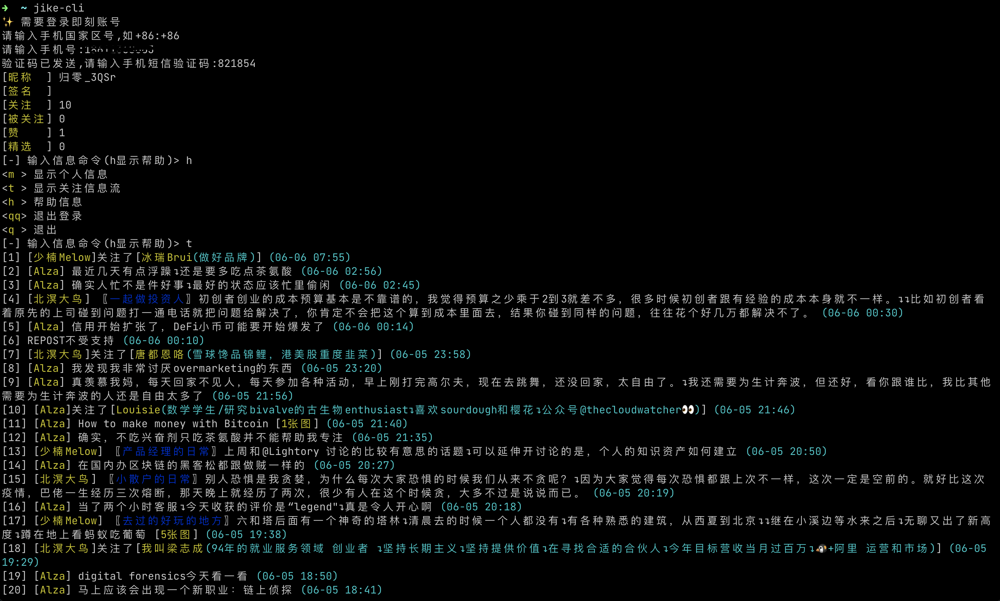

### jike-cli

即刻命令行客户端, 已支持短信登录、看动态、发动态、点赞、取消赞、评论、查看关注和被关注列表

#### 食用方法

Mac 环境如果有 Homebrew 就很简单

```
brew install junbaor/brew/jike-cli
```

#### 命令规划

```
jike-cli             交互式显示关注的时间线
jike-cli login       登录
jike-cli logout      登出
jike-cli me          显示个人信息
jike-cli home        交互式显示个人动态列表
jike-cli msg         显示通知 (待实现)
jike-cli notice      显示系统通知 (待实现)
jike-cli following   交互式显示关注列表
jike-cli follower    交互式显示被关注列表
jike-cli -h          显示帮助信息
jike-cli -V          显示版本号
jike-cli -n          发表动态
```

##### 时间线子命令
```
[1] [瓦恁] 再也不小心翼翼上网，我要回到千禧年 (06-08 15:37)
[2] ...
[3] ...
📝 请输入命令 (h 显示帮助) > h
<j> 下一页
<r> 刷新
<h> 帮助
<q> 退出
<g> 查看作者动态
<c 序号 评论内容> 查看作者动态
<nb 序号> 点赞
<lj 序号> 取消点赞
📝 请输入命令 (h 显示帮助) > nb 1
点赞成功
📝 请输入命令 (h 显示帮助) > r
[1] 👍🏻 [瓦恁] 再也不小心翼翼上网，我要回到千禧年 (06-08 15:37)
```


#### 截图

